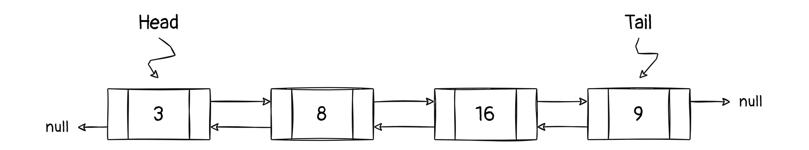

# Algorithm-DS

Алгоритмы и структуры данных на некоторых языках программирования. Этот репозиторий создан для тренировки. Здесь будут представлены заметки и псевдокод о разных темах.

    Информация будет сначала появляться здесь, а только потом переводиться на английский

## Базовые структуры

* [x] [Массив(статический)](#array)
* [x] [Связный список](#linked-list)
* [ ] Стек
* [ ] Очередь
* [ ] Дерево
* [ ] Массив(динамический)

### Массив (статический)

* Непрерывный блок памяти
* Фиксированный размер
* Константный доступ по индексу

Из-за непрерывности в памяти можно хранить лишь ссылку на первый элемент и количество элементов в массиве(n). Далее можно легко найти любой элемент по формуле:

`
elem T = начальный адрес + (индекс * размер ячейки)
`

#### Вычислительная сложность

|            | Вставка | Удаление |
| :--------: | :-----: | :------: |
|  В начало  |  O(n)   |   O(n)   |
|  В конец   |  O(1)   |   O(1)   |
| В середину |  O(n)   |   O(n)   |

### Связный список

* Элементы находятся произвольно в памяти
* Хранит не только значение но и ссылку(ки)
* Произвольный размер

Из-за того что элементы находятся произвольно в памяти, элемент связного списка хранит не только значение(key) но и ссылку на следующий элемент.

Обязательно хранят ссылку на первый элемент списка (Голову/Head). Иногда для некоторых задач и для упрощения вычислений хранят ссылку на последний элемент списка(Хвост/Tail)

В зависимости от реализации структура одного элемента может отличаться, есть такие реализации списков:

* Односвязный - элемент имеет ссылку только на следующий за ним.
* Двусвязный - элемент хранит ссылку на предыдущий и следующий элементы.
* Кольцевой - может быть как односвязным так и двусвязным, но отличается тем, что последний элемент указывает на первый.

#### Вычислительная сложность

|            | Вставка | Удаление |
| :--------: | :-----: | :------: |
|  В начало  |  O(1)   |   O(1)   |
|  В конец   |  O(1)   |   O(1)   |
| В середину |  O(1)   |   O(1)   |

P.S. _В зависимости от реализации оценка сложности может сильно отличаться_
